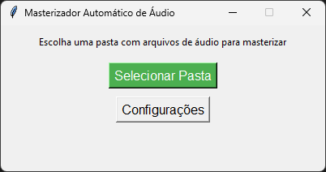
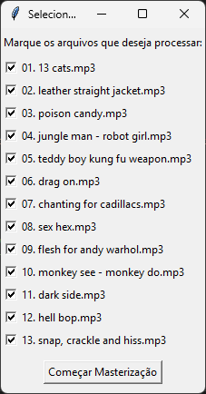
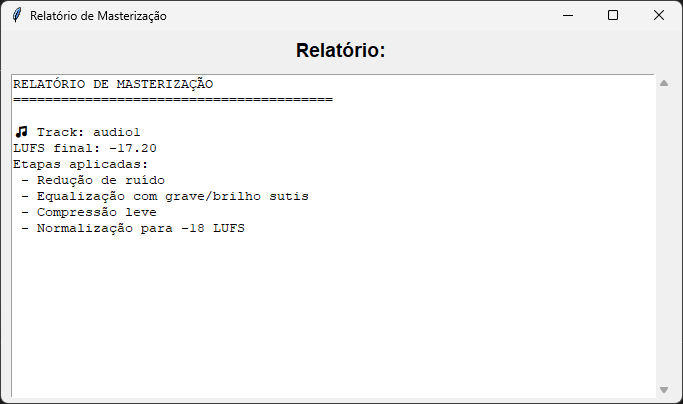

# 🎧 Masterizador de Áudio em Lote

Um utilitário desktop feito em Python que permite aplicar **masterização artística e normalização de LUFS** em múltiplos arquivos de áudio com poucos cliques.

Ideal para músicos, produtores independentes, podcasters e qualquer criador que deseja uniformizar e melhorar a qualidade sonora das faixas em lote.

---

## 🛠️ Funcionalidades

- ✅ Redução automática de ruído
- ✅ Equalização suave (graves e agudos)
- ✅ Compressão leve
- ✅ Normalização de volume para -18 LUFS usando FFmpeg
- ✅ Interface gráfica intuitiva (Tkinter)
- ✅ Seleção de múltiplas faixas para processar
- ✅ Ajustes manuais de parâmetros de áudio
- ✅ Relatório visual e em texto com gráfico final de loudness

---

## 📸 Capturas de Tela

<br>
<br>
<br>
<br>


---

## 🚀 Como usar

### 1. Clone o repositório

```bash
git clone https://github.com/seu-usuario/nome-do-repositorio.git
cd nome-do-repositorio
```
### 2. Instale as dependências

```bash
python -m venv venv
venv\Scripts\activate  # No Windows
source venv/bin/activate  # No Linux/macOS

pip install -r requirements.txt
```

### 3. Execute o programa
```bash
python audio-opt.py
```